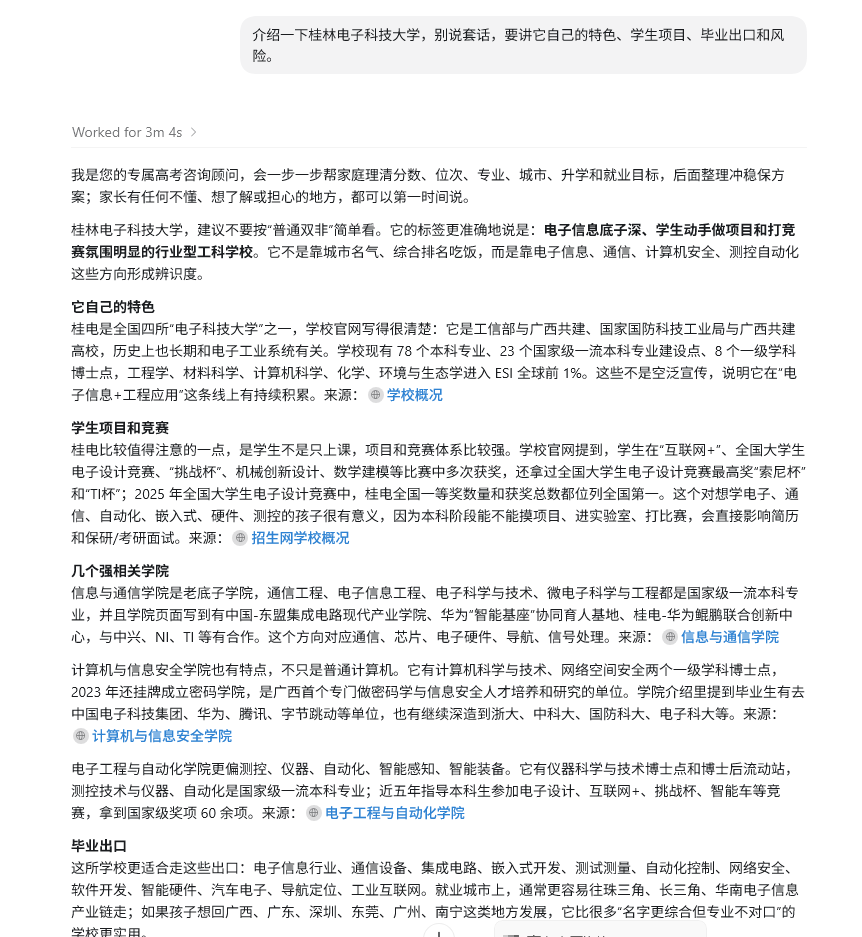
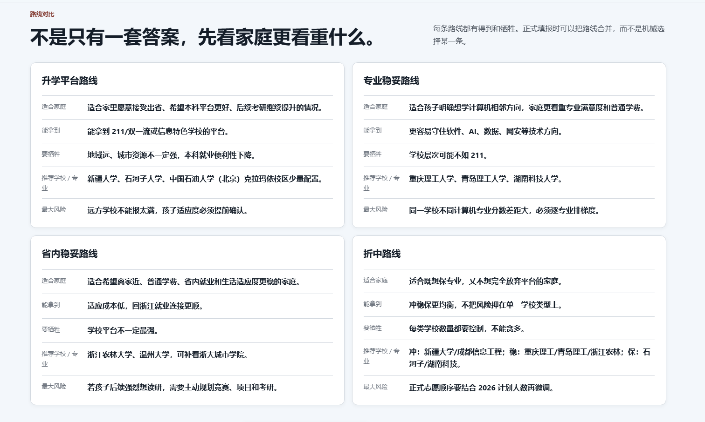
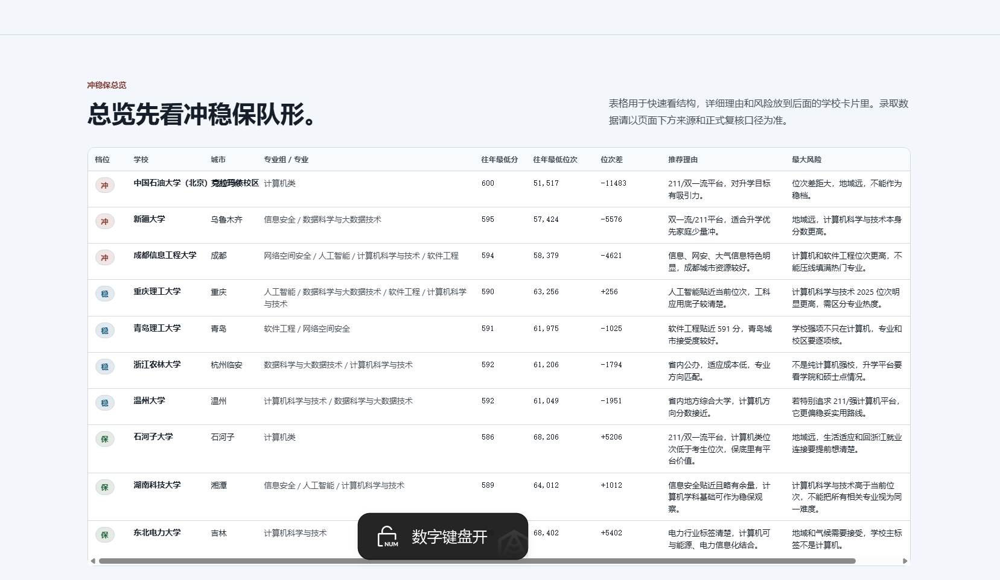
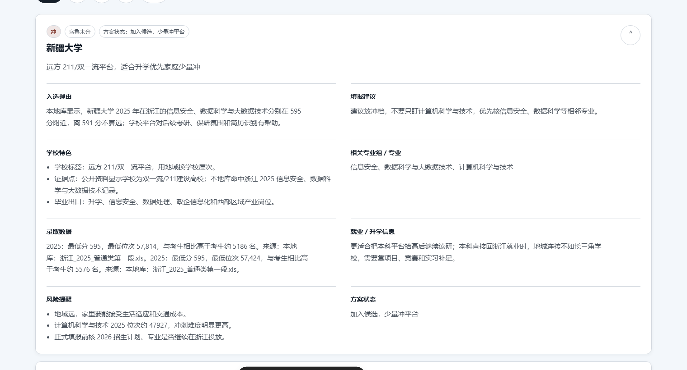
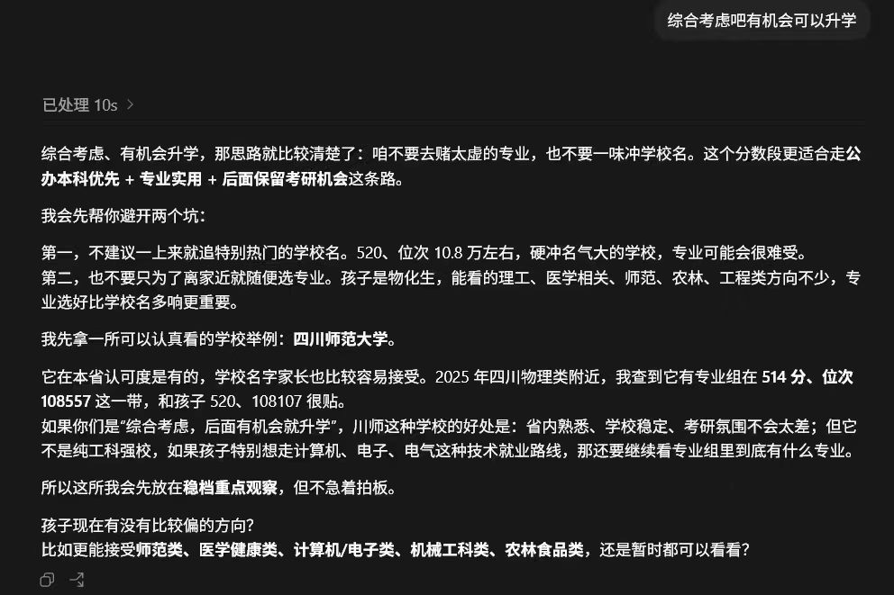
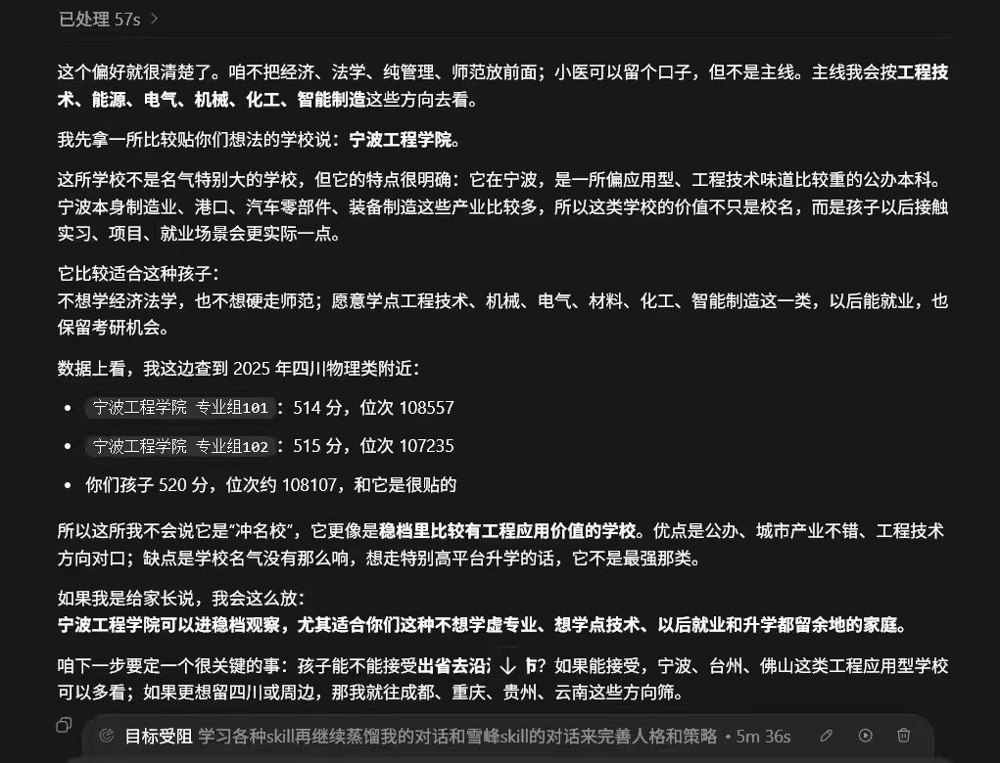

# 高考志愿全自动咨询系统

一个面向高考志愿咨询场景的开源 Skill + 本地网页原型。

它不只是一个会聊天的人设提示词，而是把真实咨询流程拆成几层可复用能力：

- 主动追问家长和学生的关键信息
- 根据分数、位次、专业偏好、地域偏好和家庭目标筛选候选
- 输出冲、稳、保路径建议
- 联网补充公开证据
- 生成给家长看的正式 HTML 报告

## 项目定位

这个项目更像“高考志愿咨询工作台”的最小开源版本：

- 对话上，尽量像真人填报老师，不一上来就甩一张大表
- 逻辑上，把推荐拆成数据筛选、路径判断、风险提醒和报告输出
- 工程上，保留可以直接继续开发的 Skill、网页原型、参考文档和样例数据

## 包含内容

- `SKILL.md`
  Codex / agent 调用说明，定义了咨询节奏、追问规则、报告阈值和风险提醒。

- `references/`
  咨询节奏、筛选逻辑、学校调研方法、对话风格约束。

- `assets/app/`
  本地可运行网页原型，包含推荐引擎、联网取证入口、正式报告导出。

- `agents/openai.yaml`
  默认展示配置。

## 功能预览

### 1. 对话式学校分析



### 2. 路线对比



### 3. 冲稳保总览



### 4. 单校详情卡片



### 5. 暗色对话示例一



### 6. 暗色对话示例二



## 适合谁

- 想把高考志愿咨询流程做成 agent / skill 的开发者
- 想搭一个本地可演示的志愿咨询网页原型的人
- 想把自己已有录取数据库接进咨询系统的人

## 快速开始

### Skill 侧

把这个目录放进你的 Codex skills 目录后，可以直接这样触发：

```text
Use $gaokao-volunteer-advisor 帮一个湖北物理类考生做志愿咨询，先主动问家长和学生问题。
```

### 网页原型

```powershell
powershell -ExecutionPolicy Bypass -File .\scripts\run_web.ps1
```

或者：

```bash
cd assets/app
python main.py --api --port 8765
```

打开：

```text
http://127.0.0.1:8765/
```

## 数据说明

这个开源仓库默认只带样例数据，不附带私有录取数据库。

如果你有自己的真实库，可以放到：

```text
assets/app/data/admission_clean.db
```

程序会优先读取它；如果没有，就自动回退到样例数据。

## 开源版本说明

这个仓库已经去掉了：

- 历史打包产物
- 私有分发包
- 运行日志和缓存
- 本机绑定路径
- 大体积私有数据库和二进制依赖

默认只保留样例数据和可公开的原型结构，方便继续扩展。

## 下一步建议

- 接入真实录取数据库
- 增加学校 / 专业对比页
- 增加多轮状态保存
- 增加家长版 / 学生版双报告
- 补更多真实咨询案例
